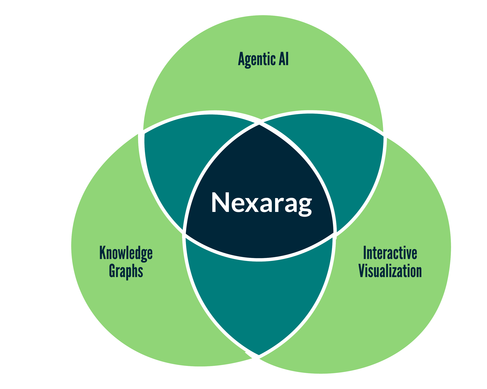

<p align="center">
  <a href="https://github.com/KevinMoonLab/Nexarag"></a>
</p>

# Overview

**Nexarag** is an open-source platform for building knowledge graphs from research papers and querying them with AI, enabling transparent and reproducible literature analysis without the hallucinations of traditional RAG systems. Deploy locally with full privacy control or integrate with any LLM via the standardized Model Context Protocol (MCP).

See also:
* [Usage and Development Guides](/docs/index.md)

# Feedback

We are actively seeking feedback for Nexarag, including feature requests, issue reports, training material, etc. Please submit to `nexarag.ai@gmail.com`.

# Pre-Requisites
- [Docker](https://docs.docker.com/engine/install/)
- **(Windows Only)** [WSL2](https://learn.microsoft.com/en-us/windows/wsl/install)
- **(MacOS Only)** [Ollama Desktop](https://ollama.com/download/mac)
- **(Optional)** [Claude Desktop (for MCP)](https://claude.ai/download)

# Quick Start

## 1. Download Docker compose file
Choose a Dockerfile compatible with your OS and hardware:

* [MacOS](docker/prod/mac/docker-compose.yml)
* [Linux/WSL (CPU)](docker/prod/cpu/docker-compose.yml)
* [Linux/WSL (GPU)](docker/prod/gpu/docker-compose.yml)

**[Optional]**: Move the Docker compose file to a location on your drive, e.g. `~/Nexarag`.

## 2. Run Nexarag
From the same directory as the downloaded `docker-compose.yml`, run:
```bash
docker compose up -d
```
Visit Nexarag in your browser at `http://localhost:5000`. 

## 3. Pull Ollama Models
To support all internal features, Nexarag requires:

* An embedding model, such as `nomic-embed-text:v1.5`
* A language model, such as `gemma3:1b`
* An MCP-capable model, such as `qwen3:8b`

Browse the full library of Ollama models [here](https://ollama.com/library) and choose any model from these families that your hardware supports.  Defaults that run on most hardware are provided below.

### Linux/WSL

Models can be pulled through the command line in the `ollama` Docker container.

```bash
docker exec -it nexarag.ollama /bin/bash
ollama pull nomic-embed-text:v1.5
ollama pull gemma3:1b
ollama pull qwen3:8b
```

### MacOS

Pull models directly from your command line.

```bash
ollama pull nomic-embed-text:v1.5
ollama pull gemma3:1b
ollama pull qwen3:8b
```

## 4. (Optional) MCP Integration
### Claude Desktop
Add the following to your Claude Desktop Config:

```json
{
    "mcpServers": {
        "nexarag": {
            "command": "npx",
            "args": [
            "-y",
            "mcp-remote",
            "http://localhost:9000/mcp"
            ],
            "env": {
            "MCP_TRANSPORT_STRATEGY": "http-only"
            }
        }
    }
}
```

### Ollama
First install [pipx](https://github.com/pypa/pipx), then run:

```bash
pipx install ollmcp
```

To start the MCP client:
```bash
ollmcp -u http://localhost:9000/mcp -m gpt-oss:20b
```

# Semantic Scholar
Please note that we are rate-limited by the Semantic Scholar API, so enriching BibTex uploads with data and updating the graph after adding papers from a Semantic Scholar search may take several minutes to complete.
